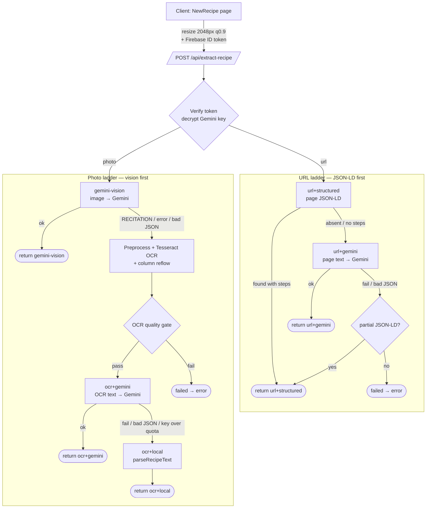

# Recipe Extraction Architecture

How a photo or URL becomes a structured recipe in Beckfield Bistro. This document
is the source of truth for the extraction pipeline — written for both humans
(overview, rationale) and AI agents working in the code (exact paths, shapes,
invariants, and where to change what).

> **TL;DR** — Photos try Gemini vision first, then fall back to OCR + Gemini, then
> a deterministic local parser. URLs try the page's own JSON‑LD structured data
> first, then Gemini. Every path has a deterministic fallback so a readable input
> almost always yields an editable recipe, and every outcome is counted so the
> method order can be revisited from real data.

---

## 1. Why this exists

The original implementation sent the photo straight to Gemini, which **transcribed
and structured in one step**. Transcribing a copyrighted cookbook page verbatim
trips Gemini's **RECITATION** safety filter (finish reason `RECITATION`), returning
a hard block instead of a recipe. Users hit this constantly on published cookbooks.

The pipeline is built around three principles:

1. **Accuracy to source.** Ingredient `originalText` and step wording must match the
   page. We prefer a deterministic transcription/structuring over a model that might
   paraphrase or drift.
2. **A deterministic fallback at every stage.** A readable input should always return
   a result the user can edit, even if every AI call fails or is blocked.
3. **Observability over guesswork.** Which method produced each result is recorded,
   so the ordering can be tuned from real fallback rates rather than assumption.

RECITATION is the key constraint to keep in mind: it fires on the **output** matching
copyrighted text, so it correlates with published cookbooks. Deterministic steps
(OCR, JSON‑LD, local parsing) can never trip it; a Gemini call that reproduces the
recipe can.

---

## 2. Components at a glance

| Layer | File | Responsibility |
|-------|------|----------------|
| Client wrapper | `src/lib/recipeExtraction.ts` | Resize image, attach auth token, POST to the API, surface errors |
| Client UI | `src/pages/NewRecipe/index.tsx` | Capture/crop/URL entry, call the wrapper, populate the editable form |
| API handler | `api/extract-recipe.ts` | Auth, key decryption, the full method ladders, analytics, response shaping |
| OCR module | `api/_utils/ocr.ts` | Image preprocessing, Tesseract engine, **column reflow**, quality gate |
| Parsers | `api/_utils/recipeParsers.ts` | Deterministic ingredient/step parsing, `parseRecipeText`, JSON‑LD helpers' dependencies |
| Crypto | `api/_utils/crypto.ts` | AES‑256‑GCM decrypt of the per‑user Gemini key |
| Traineddata | `api/_tessdata/eng.traineddata.gz` | English Tesseract model, bundled into the function |
| Function config | `vercel.json` | `maxDuration: 60` and `includeFiles` for the Tesseract runtime |

There is **one** extraction endpoint: `/api/extract-recipe`. (A former
`/api/extract-recipe-url` endpoint was removed — its logic lives here now.)

---

## 3. End‑to‑end flow



Every terminal node calls `recordExtractionMethod(...)` before responding (including
the `failed` nodes).

---

## 4. Client contract

`src/lib/recipeExtraction.ts`

- **`extractRecipeFromImage(dataUrl, hasApiKey)`** → resizes with
  `resizeImage(dataUrl, { maxDimension: 2048, quality: 0.9 })`, then POSTs
  `{ base64, mediaType }`.
- **`extractRecipeFromUrl(url, hasApiKey)`** → POSTs `{ url }`.
- Both attach `Authorization: Bearer <Firebase ID token>` and throw
  `RecipeExtractionError(message)` on non‑2xx, using the server's `error` string.

`resizeImage(dataUrl, { maxDimension = 1568, quality = 0.85 })` is shared: the
**1568/0.85 default is for cover images** (stored as data URLs inside Firestore docs,
which have a 1 MiB cap) and **must not be raised globally**. Only the extraction call
uses 2048/0.9, which stays under the endpoint's 8 MB body limit.

---

## 5. Server: `api/extract-recipe.ts`

### 5.1 Preamble (both inputs)
1. `POST` only; verify the Firebase ID token → `uid`.
2. Read `users/{uid}/meta/profile.geminiApiKeyEncrypted` and decrypt it
   (`decryptSecret`, `API_KEY_ENCRYPTION_SECRET`). **Keys are per‑user and billed to
   the user — there is no shared server key.** Missing key → 400 asking them to add one.
3. Branch on `hasImage` (`base64` present) vs `hasUrl` (`url` present).

### 5.2 Photo ladder (vision first)
1. **`gemini-vision`** — `callGeminiWithRetry(imageParts, SYSTEM_PROMPT)` where
   `imageParts = [{ inlineData }, USER_PROMPT]`. Parseable JSON → return. A
   RECITATION block (or any error, or unparseable output) is caught into `visionError`
   and drops to OCR. The `forceOcr: true` body flag skips this step (debug/rollback).
2. **OCR** — `preprocessForOcr(buffer)` → `getOcrEngine().recognize(...)` →
   `assessOcrQuality(ocr)`.
   - **Gate passes:**
     - **`ocr+gemini`** — unless `visionError` was a rate‑limit (same key would fail
       again), `callGeminiWithRetry([ocrUserPrompt(text)], OCR_SYSTEM_PROMPT)`.
       Parseable → return, with `ocrText` included.
     - **`ocr+local`** — `parseRecipeText(ocrText)` (deterministic) → return, with
       `ocrText` included.
   - **Gate fails** → **`failed`**: if `visionError` exists, map it with
     `sendGeminiError`; otherwise 422 "try a clearer photo / enter manually".

### 5.3 URL ladder (JSON‑LD first)
1. Fetch the page (5 s timeout, must be `text/html`); derive `coverImage`
   (`extractPageImage`) and `pageText` (`stripHtml`, newline‑collapsing).
2. **`url+structured`** — `findJsonLdRecipe(html)` + `jsonLdToRecipe(ld, hostname)`.
   A `schema.org/Recipe` node (exact to source, free, RECITATION‑proof) → return —
   **but only when it actually carries a method.** A page that publishes a Recipe
   with ingredients but an empty/unreadable `recipeInstructions` would otherwise
   return a recipe with no steps ("missing method"), so that case **falls through
   to Gemini** to recover the method, keeping the partial structured recipe as a
   last‑resort return so the ingredients are never lost.
3. **`url+gemini`** — `callGeminiWithRetry([<page text prompt>])`. Parseable → return;
   thrown error → the salvaged partial JSON‑LD if there was one, else **`failed`**
   via `sendGeminiError`.
4. Unparseable / nothing usable → the salvaged partial JSON‑LD if there was one,
   else **`failed`** 422.

> Note: the URL local parser `parseRecipeText` is **not** used here because
> `stripHtml` collapses newlines and that parser is line‑based. JSON‑LD is the URL
> path's deterministic rung instead.

### 5.4 Shared Gemini retry — `callGeminiWithRetry(genAI, parts, systemInstruction?)`
- `PRIMARY = gemini-3.1-flash-lite`, `FALLBACK = gemini-3.5-flash`.
- Retries the primary on **503 overload** with backoff `[0, 1000, 2500] ms`; a **429
  rate‑limit** skips straight to the fallback model (separate quota bucket).
- **RECITATION and any other error are thrown to the caller** — each caller has a more
  faithful recovery than a phrasing‑loosened retry (photos → OCR; URLs → JSON‑LD or a
  clear 422). There is intentionally **no temperature‑1.3 recovery** anymore.

### 5.5 Error classification & mapping
- `isRateLimitError` → 429, `isOverloadError` → 503, `isRecitationError` → 422,
  else → 502. Centralized in `sendGeminiError(res, err)`.

---

## 6. OCR module: `api/_utils/ocr.ts`

Behind the `OcrEngine` interface so a cloud OCR (e.g. Google Cloud Vision) can replace
Tesseract by adding one class and switching `getOcrEngine()` — callers never change.

```ts
interface OcrResult { text: string; confidence: number; columnsReflowed: boolean }
interface OcrEngine { readonly name: string; recognize(image: Buffer): Promise<OcrResult> }
```

- **Worker lifecycle** — one Tesseract worker per warm serverless instance (wasm +
  traineddata init is expensive), with a promise‑chain mutex so concurrent invocations
  serialize onto the single worker. On worker error the worker is dropped and re‑init'd.
  Language `eng` from `api/_tessdata/eng.traineddata.gz` (bundled via `includeFiles`).
- **`preprocessForOcr(image)`** — sharp: EXIF `rotate()`, upscale small images toward
  ~300 dpi (cap ~2800/3000 px), grayscale, `normalize`, `sharpen`, PNG. No hard
  threshold (Tesseract's Otsu handles uneven lighting better).
- **Column reflow — `reflowColumns` (the important part).** Tesseract merges
  side‑by‑side columns (ingredients | method) into single lines, gluing ingredient
  text to method text so the structuring step drops ingredients. The reflow rebuilds
  reading order from **word bounding boxes**:
  1. Detect wide inter‑word gaps; require enough of them clustered at a consistent x
     (else it's single‑column → return `null`, pass through unchanged).
  2. Fit the **method column's left edge** as a sloped line (least squares on gap
     right‑edges) — the divider is the second column's start, which is stable even as
     ingredient line lengths vary and the page tilts/curves in a hand‑held photo.
  3. Classify each row by the vertical **two‑column band**: rows inside it are split at
     the local edge (robust to OCR fusing an ingredient's last word with the method
     word beside it); rows outside it (title/intro/note/footer) are kept whole.
  4. Emit the left column top‑to‑bottom, then the right. `columnsReflowed` records
     whether a reflow happened (also logged server‑side).
- **Quality gate — `assessOcrQuality`.** All must hold: text ≥ **150** chars,
  confidence ≥ **60**, alpha ratio (`[A-Za-z]` / non‑whitespace) ≥ **0.55**, non‑empty
  lines ≥ **6**. Failing any one routes the photo back to `gemini-vision` (or `failed`).

---

## 7. Parsers: `api/_utils/recipeParsers.ts`

Deterministic, model‑free. Shared by the OCR fallback and (via their dependencies) the
JSON‑LD path.

- `parseIngredientLine(line)` — splits quantity / unit / name; handles fractions and
  unicode (½, ⅓…). Preserves the full line as `originalText`.
- `buildIngredientSections(lines)` / `looksLikeSectionHeader(line)` — group ingredients
  under sub‑headers ("For the curry").
- `flattenInstructions(value)` — normalizes a `schema.org` `recipeInstructions`
  value into an ordered step list. Handles every shape real sites use: a single
  `Text` string (split on block separators — a bare string is **not** walked
  character‑by‑character), an array of strings, and nested
  `HowToStep`/`HowToSection`/`ItemList` (or untyped) wrappers, stripping any HTML
  tags/entities embedded in step text.
- `parseIsoDuration(iso)` — `PT15M` → "15 mins".
- `parseRecipeText(ocrText)` — the OCR last‑resort structurer: rejoins hyphenation,
  finds INGREDIENTS/METHOD headers (or bounds the contiguous amount‑led block when a
  cookbook uses "For the …" sub‑headings), and groups steps.

JSON‑LD helpers live in `api/extract-recipe.ts`: `findJsonLdRecipe(html)` (scans
`application/ld+json`, handles `@graph` and array `@type`) and `jsonLdToRecipe(ld,
source)` (→ response shape, or `null` if it has neither ingredients nor steps).

---

## 8. Response shape

All success responses share this shape (extra fields are additive and backward‑compatible):

```jsonc
{
  "title": "string",
  "source": "string",              // cookbook/site, or 'Photo Upload'
  "servings": 4,
  "prepTime": "15 mins",           // or ''
  "totalTime": "40 mins",          // or ''
  "ingredientSections": [
    { "title": "For the curry",    // '' when a single unlabelled group
      "ingredients": [
        { "name": "rapeseed oil", "quantity": 3, "unit": "tbsp",
          "originalText": "3 tbsp rapeseed oil" }
      ] }
  ],
  "ingredients": [ /* flattened convenience copy of all sections */ ],
  "steps": ["string", "…"],
  "extractionMethod": "gemini-vision",   // see §9
  "ocrText": "…",                        // photo OCR paths only (≤ 15k chars)
  "coverImage": "https://…"              // URL paths only, when found
}
```

The client's `RecipeForm` lifts only named fields, so adding response fields never
persists anything unexpected to Firestore.

---

## 9. Extraction methods & analytics

`extractionMethod` (and the `recordExtractionMethod` counter key) is one of:

| Method | Input | Meaning | Gemini sees the image? |
|--------|-------|---------|------------------------|
| `gemini-vision` | photo | Gemini transcribed + structured the image | **yes** (only path where RECITATION is possible) |
| `ocr+gemini` | photo | Tesseract transcribed; Gemini structured the **text** | no |
| `ocr+local` | photo | Tesseract transcribed; `parseRecipeText` structured it | no (no Gemini) |
| `url+structured` | url | Page's own JSON‑LD recipe data | no |
| `url+gemini` | url | Gemini structured the page text | no |
| `failed` | either | No path produced a recipe | — |

**Tracking** — `recordExtractionMethod(method)` (best‑effort; never fails the request):
- logs `extract-recipe: extractionMethod=<method>`;
- increments Firestore counters at `analytics/extractionStats` (lifetime) and
  `analytics/extractionStats-YYYY-MM-DD` (daily), each holding
  `{ counts: { <method>: n, … }, total }`.

**Reading the signal.** A rising `ocr+*` share means vision is being blocked/failing a
lot on photos; a high `url+gemini` share means few sites carried usable JSON‑LD. Either
is grounds to revisit method order (both are localized changes in the handler).

---

## 10. Configuration

Environment variables (names only):
- `VITE_FIREBASE_*` — client Firebase config.
- `FIREBASE_SERVICE_ACCOUNT` — server admin JSON for token verification.
- `API_KEY_ENCRYPTION_SECRET` — base64 32‑byte AES‑256‑GCM key for the per‑user Gemini keys.
- Per‑user Gemini keys live encrypted in Firestore; there is no shared `GEMINI_API_KEY`
  in production (`test-*.ts` smoke scripts use one locally).

`vercel.json` — `api/extract-recipe.ts` has `maxDuration: 60` and an `includeFiles`
glob that ships the traineddata + Tesseract wasm core + worker script, which nft can't
trace through Tesseract's dynamic `require`. **Removing that glob breaks OCR at runtime.**

---

## 11. Testing & debugging

- **`test-ocr.ts`** (`npx tsx test-ocr.ts [fixtures/.jpg]`) — offline: preprocess →
  OCR → `columnsReflowed` → gate → `parseRecipeText`; optionally runs the Gemini
  structuring if `GEMINI_API_KEY` is set. Fixtures in `fixtures/`:
  `recipe-print.jpg` (clean single column), `recipe-twocol.jpg` and `recipe-real.jpg`
  (two‑column, exercise the reflow), `recipe-hard.jpg` (should fail the gate).
- **`forceOcr: true`** in the request body skips vision — use it to exercise/verify the
  OCR path directly.
- **Server logs** carry `extractionMethod=…`, `ocr confidence=… chars=…
  columnsReflowed=…`, and gate‑fail reasons.
- **Response fields** `extractionMethod` and `ocrText` tell you which path ran and what
  the OCR actually read.
- Tesseract bundling can only be fully verified on a **Vercel preview deploy** — a local
  pass does not prove `includeFiles` is correct.

---

## 12. Known failure modes (watch these)

- **Silent OCR character errors.** Tesseract can be confidently wrong (`0/O`, `1/l`,
  `5/S`), corrupting quantities without failing the gate. The most insidious accuracy
  risk. A per‑word‑confidence flag or an `originalText`‑appears‑in‑OCR check would catch
  it (not yet implemented).
- **Reflow false positive.** A tabular ingredient list (amounts aligned in one column,
  names in another) can look like two columns and get split, divorcing quantities from
  names.
- **Reflow miss (`columnsReflowed=false` when it should be true).** Heavy page curvature,
  columns closer than the min‑gutter, tilt beyond ~11°, or 3+ columns.
- **Gate too strict / lenient.** Number‑dense recipes can dip below the 0.55 alpha ratio
  (false reject → routed to vision); non‑recipe pages that are merely readable pass and
  get structured into nonsense.

See git history / the PR discussion for the reasoning behind each threshold.

---

## 13. Extending the pipeline (recipes for common changes)

- **Swap the OCR engine** → add a class implementing `OcrEngine` in `api/_utils/ocr.ts`
  and return it from `getOcrEngine()`. Nothing else changes.
- **Add an OCR language** → drop `<lang>.traineddata.gz` into `api/_tessdata/`, ensure
  it's in the `includeFiles` glob, and change the `createWorker('eng', …)` language.
- **Reorder methods** → the ladders are linear blocks in `api/extract-recipe.ts`
  (§5.2 / §5.3). Reordering is moving a block; keep a `recordExtractionMethod` call on
  every terminal branch.
- **Add a new method / metric** → call `recordExtractionMethod('<name>')` before the
  response; it auto‑creates the Firestore counter. Set `extractionMethod` on the payload.
- **Tune OCR thresholds** → constants at the top of `assessOcrQuality` and the reflow
  detection in `reflowColumns` (`api/_utils/ocr.ts`). Re‑run `test-ocr.ts` against all
  fixtures after any change.

---

## 14. Invariants (do not break)

1. **Every readable input returns something editable.** Do not remove a deterministic
   fallback rung without a replacement.
2. **Cover‑image resize stays at 1568/0.85.** Larger images overflow the Firestore 1 MiB
   doc limit; only the extraction upload uses 2048/0.9.
3. **`includeFiles` in `vercel.json` must cover the traineddata + Tesseract runtime**, or
   OCR throws `MODULE_NOT_FOUND` at runtime (build still passes — verify on a preview).
4. **Gemini keys are per‑user and server‑side only.** Never accept a key from the client
   or introduce a shared production key.
5. **`originalText` and step wording are verbatim.** Prompts forbid paraphrasing; the
   deterministic paths copy source text. Keep it that way — accuracy to source is the
   product requirement.
6. **Keep a `recordExtractionMethod` call on every terminal branch**, including failures,
   or the analytics denominator drifts.
